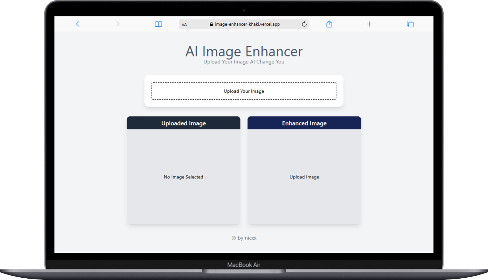
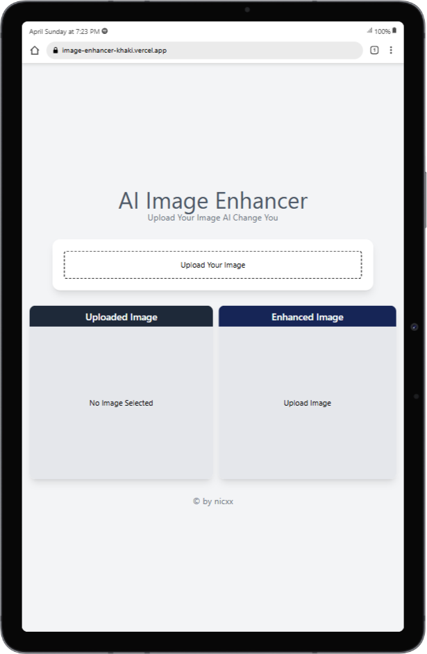
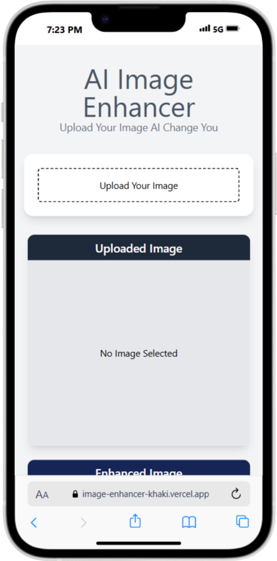

# Enhanced Image Downloader

A React application that allows users to view and download enhanced images directly from the browser. The images are fetched from an API and optionally hosted/stored on Cloudinary.

---

## 🔍 Purpose

The main goal of this project is to provide a simple and clean UI for:
- Displaying enhanced or processed images
- Allowing users to download those images without redirecting or opening a new tab

---

## 🚀 Features

- ⚛️ Built with React
- 📦 Fetch image data from an external API
- ☁️ Uses Cloudinary for image hosting (optional)
- 📥 One-click image download (without opening in a new tab)
- 🎨 Responsive and clean UI with Tailwind CSS

---

## 🧰 Tech Stack

- **React** – Frontend library
- **Tailwind CSS** – Styling framework
- **Cloudinary** – Image hosting and delivery
- **Fetch API** – To retrieve images
- **Blob API** – For enabling direct download without navigation









---

## 🛠️ Installation & Setup

1. **Clone the repository:**

```bash
git clone https://github.com/Paradva-Niraj/image-enhancer.git
cd image-enhancer

npm install

npm run dev

npm run build

```
start server 
```bash

cd server

rpm index.js
```
